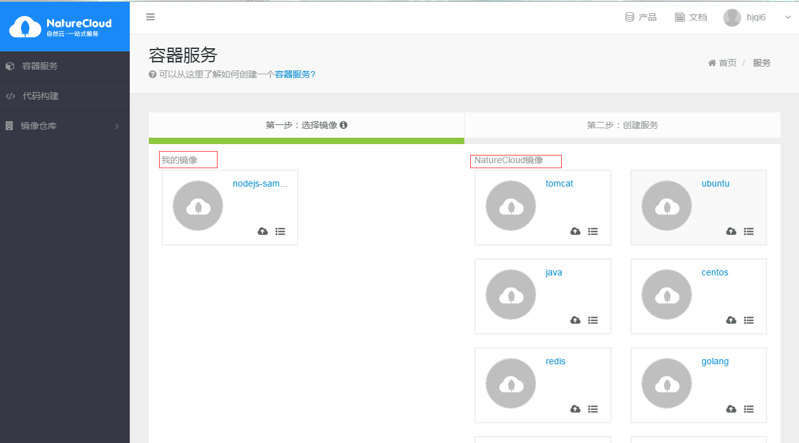
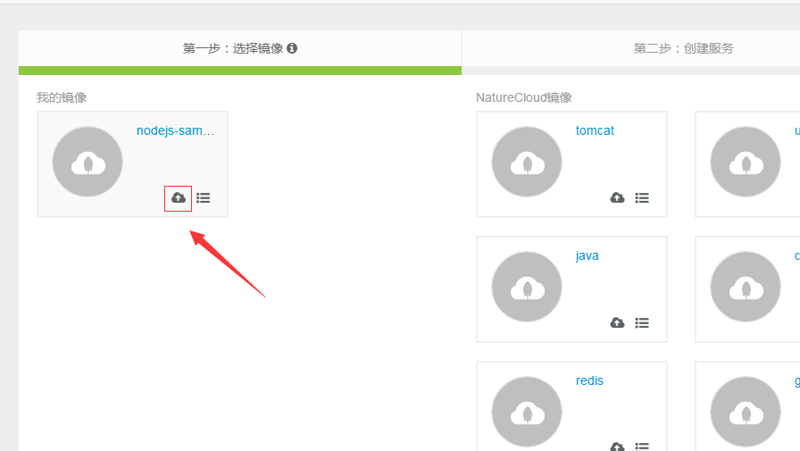
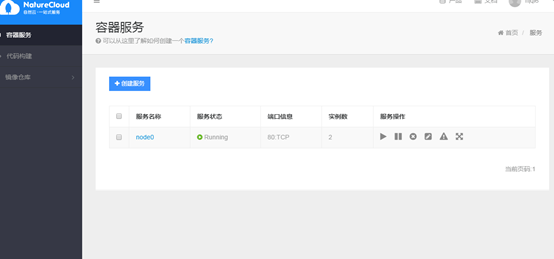

用户在登录后，进入控制台，点击左侧 容器服务
 

右侧会显示 创建过的服务列表，点击 创建服务按钮 进入服务创建页面，在服务创建页面中可以选择自己的镜像，也可以选择公有镜像。 （关于镜像的来源和具体介绍，请参考[镜像](../img)章节）

再点击镜像上的部署按钮 部署应用

然后需要填写应用信息和相关参数

> 服务名 是用户帐户下应用的唯一标识
> 
> 镜像   是在之前选择的基础上选择需要部署版本
> 
> 容量  是向平台请求服务运行资源 0.25C 代表cpu资源是250M ,128Mi代表内存资源是128m
> 
> 服务协议目前只支持HTTP，对应的服务端口是默认的80
> 
> 服务端口 是服务开放到对应的端口。
> 
> 集群容量 是指启动的实例数量，可以做高可用，负载均衡。

在填写完相关信息后，点击添加，就可以在刚才的服务列表，看到刚才添加到服务应用，并且包括当前服务的状态。

